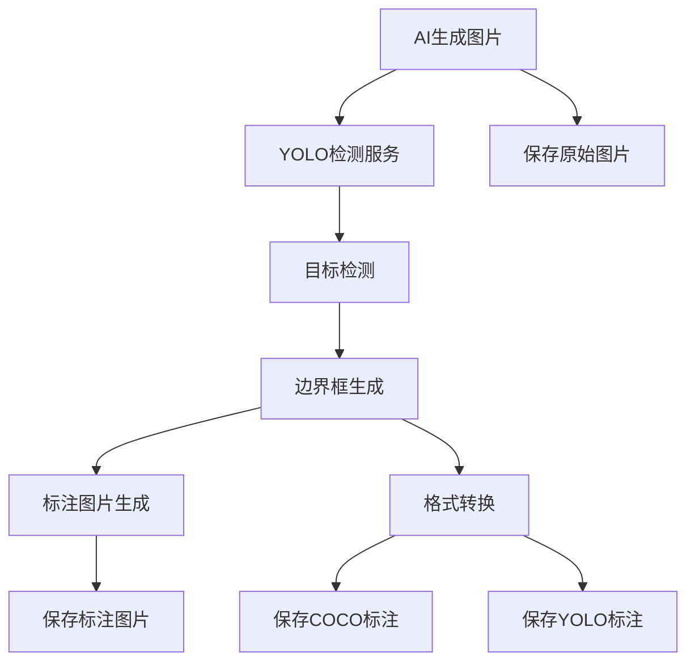

# YOLO目标检测功能开发计划

## 1. 功能概述

### 1.1. 功能目标
在AI生成图片后，自动使用YOLO模型进行目标检测，生成精确的边界框标注，并保存标注前后的图片。该功能将显著提升数据集的标注质量和准确性。

### 1.2. 核心特性
- **智能检测**：使用最新的YOLOv8/v11模型进行军事目标检测
- **双图保存**：同时保存原始图片和标注后的图片
- **多格式支持**：生成COCO和YOLO两种格式的标注文件
- **高精度标注**：相比传统方法，提供更精确的边界框坐标
- **批量处理**：支持大批量图片的高效检测
- **可配置参数**：支持置信度阈值、NMS阈值等参数调整

### 1.3. 技术架构


---

## 2. 技术实现方案

### 2.1. YOLO模型选择与部署

#### 2.1.1. 模型版本选择
- **主要选择**：YOLOv8或YOLOv11（Ultralytics实现）
- **模型规模**：
  - YOLOv8n/YOLOv11n：轻量级，适合CPU推理
  - YOLOv8s/YOLOv11s：平衡性能和速度
  - YOLOv8m/YOLOv11m：高精度，适合GPU推理
- **预训练权重**：使用COCO数据集预训练的通用模型

#### 2.1.2. 模型部署架构
```python
# 核心组件结构
class YOLODetectionService:
    def __init__(self):
        self.model_manager = YOLOModelManager()
        self.detector = ObjectDetector()
        self.annotator = AnnotationGenerator()
        self.converter = FormatConverter()
    
    def detect_and_annotate(self, image_path: str) -> DetectionResult:
        # 检测 -> 标注 -> 格式转换 -> 保存
        pass
```

### 2.2. 核心服务模块设计

#### 2.2.1. YOLO模型管理器 (YOLOModelManager)
```python
class YOLOModelManager:
    """YOLO模型管理器，负责模型加载、切换和配置"""
    
    def __init__(self):
        self.models = {}  # 缓存已加载的模型
        self.current_model = None
        self.device = self._detect_device()
    
    def load_model(self, model_path: str, model_type: str = "yolov8"):
        """加载YOLO模型"""
        pass
    
    def switch_model(self, model_name: str):
        """切换当前使用的模型"""
        pass
    
    def get_model_info(self) -> dict:
        """获取当前模型信息"""
        pass
```

#### 2.2.2. 目标检测器 (ObjectDetector)
```python
class ObjectDetector:
    """目标检测器，执行YOLO推理"""
    
    def __init__(self, model_manager: YOLOModelManager):
        self.model_manager = model_manager
        self.confidence_threshold = 0.5
        self.nms_threshold = 0.4
    
    def detect(self, image: np.ndarray) -> List[Detection]:
        """执行目标检测"""
        pass
    
    def batch_detect(self, images: List[np.ndarray]) -> List[List[Detection]]:
        """批量检测"""
        pass
    
    def filter_military_targets(self, detections: List[Detection]) -> List[Detection]:
        """筛选军事目标类别"""
        pass
```

#### 2.2.3. 标注生成器 (AnnotationGenerator)
```python
class AnnotationGenerator:
    """标注生成器，在图片上绘制边界框"""
    
    def __init__(self):
        self.colors = self._init_colors()
        self.font_scale = 0.6
        self.thickness = 2
    
    def draw_annotations(self, image: np.ndarray, detections: List[Detection]) -> np.ndarray:
        """在图片上绘制边界框和标签"""
        pass
    
    def save_annotated_image(self, image: np.ndarray, output_path: str):
        """保存标注后的图片"""
        pass
```

#### 2.2.4. 格式转换器 (FormatConverter)
```python
class FormatConverter:
    """格式转换器，转换检测结果为不同的标注格式"""
    
    def __init__(self):
        self.class_mapping = self._init_class_mapping()
    
    def to_coco_format(self, detections: List[Detection], image_info: dict) -> dict:
        """转换为COCO格式"""
        pass
    
    def to_yolo_format(self, detections: List[Detection], image_size: tuple) -> List[str]:
        """转换为YOLO格式"""
        pass
    
    def save_annotations(self, annotations: dict, output_path: str, format_type: str):
        """保存标注文件"""
        pass
```

### 2.3. 数据结构定义

#### 2.3.1. 检测结果数据结构
```python
@dataclass
class Detection:
    """单个检测结果"""
    bbox: List[float]  # [x1, y1, x2, y2]
    confidence: float
    class_id: int
    class_name: str
    
@dataclass
class DetectionResult:
    """完整检测结果"""
    image_path: str
    original_image: np.ndarray
    annotated_image: np.ndarray
    detections: List[Detection]
    processing_time: float
    
@dataclass
class YOLOConfig:
    """YOLO配置参数"""
    model_path: str
    confidence_threshold: float = 0.5
    nms_threshold: float = 0.4
    device: str = "auto"
    batch_size: int = 1
```

### 2.4. 文件存储结构

#### 2.4.1. 目录结构设计
```
dataset_name/
├── original/                    # 原始图片（YOLO检测前）
│   ├── train/
│   │   ├── image_001_original.jpg
│   │   ├── image_002_original.jpg
│   │   └── ...
│   ├── val/
│   └── test/
├── annotated/                   # 标注图片（绘制边界框后）
│   ├── train/
│   │   ├── image_001_annotated.jpg
│   │   ├── image_002_annotated.jpg
│   │   └── ...
│   ├── val/
│   └── test/
├── annotations/                 # COCO格式标注
│   ├── train.json
│   ├── val.json
│   └── test.json
├── yolo_annotations/           # YOLO格式标注
│   ├── train/
│   │   ├── image_001_original.txt
│   │   ├── image_002_original.txt
│   │   └── ...
│   ├── val/
│   └── test/
├── detection_logs/             # 检测日志
│   ├── detection_summary.json
│   └── failed_detections.log
└── dataset_info.json          # 数据集元信息
```

#### 2.4.2. 文件命名规则
- **原始图片**：`{image_id}_original.{ext}`
- **标注图片**：`{image_id}_annotated.{ext}`
- **YOLO标注**：`{image_id}_original.txt`
- **检测日志**：`detection_{timestamp}.json`

---

## 3. 开发任务分解

### 3.1. 第一阶段：基础框架搭建（1周）

#### 3.1.1. 环境配置和依赖安装
- [ ] 安装Ultralytics YOLO库
- [ ] 配置PyTorch和CUDA环境
- [ ] 下载预训练YOLO模型权重
- [ ] 测试模型加载和基础推理

#### 3.1.2. 核心类结构实现
- [ ] 实现YOLOModelManager基础框架
- [ ] 实现ObjectDetector基础框架
- [ ] 实现AnnotationGenerator基础框架
- [ ] 实现FormatConverter基础框架
- [ ] 定义数据结构和配置类

#### 3.1.3. 单元测试
- [ ] 编写模型加载测试
- [ ] 编写基础检测功能测试
- [ ] 编写数据结构验证测试

### 3.2. 第二阶段：核心检测功能（1.5周）

#### 3.2.1. YOLO检测实现
- [ ] 实现单张图片检测功能
- [ ] 实现批量图片检测功能
- [ ] 实现置信度和NMS阈值筛选
- [ ] 实现军事目标类别映射和筛选

#### 3.2.2. 性能优化
- [ ] 实现GPU/CPU自动选择
- [ ] 实现批量处理优化
- [ ] 实现内存管理优化
- [ ] 添加检测时间统计

#### 3.2.3. 错误处理
- [ ] 实现检测失败重试机制
- [ ] 添加异常日志记录
- [ ] 实现检测结果验证

### 3.3. 第三阶段：标注和格式转换（1周）

#### 3.3.1. 标注图片生成
- [ ] 实现边界框绘制功能
- [ ] 实现类别标签绘制
- [ ] 实现颜色配置和样式设置
- [ ] 实现标注图片保存

#### 3.3.2. 格式转换实现
- [ ] 实现YOLO到COCO格式转换
- [ ] 实现COCO格式JSON生成
- [ ] 实现YOLO格式TXT生成
- [ ] 实现批量标注文件生成

#### 3.3.3. 文件管理
- [ ] 实现目录结构自动创建
- [ ] 实现文件命名规则
- [ ] 实现原始图片和标注图片分别保存
- [ ] 实现检测日志记录

### 3.4. 第四阶段：服务集成（1周）

#### 3.4.1. 后端API集成
- [ ] 创建YOLO检测API端点
- [ ] 集成到现有的图像生成工作流
- [ ] 实现异步任务支持（Celery）
- [ ] 添加进度跟踪和状态更新

#### 3.4.2. 数据库集成
- [ ] 扩展数据库模型支持YOLO检测信息
- [ ] 实现检测结果存储
- [ ] 实现检测统计信息记录
- [ ] 实现检测历史查询

#### 3.4.3. 配置管理
- [ ] 实现YOLO配置参数管理
- [ ] 支持多模型配置和切换
- [ ] 实现配置文件读取和保存
- [ ] 添加配置验证功能

### 3.5. 第五阶段：前端界面集成（1周）

#### 3.5.1. GUI功能扩展
- [ ] 添加YOLO检测开关选项
- [ ] 添加检测参数配置界面
- [ ] 添加模型选择和管理界面
- [ ] 实现检测进度显示

#### 3.5.2. 结果展示
- [ ] 实现检测结果预览
- [ ] 支持原始图片和标注图片对比查看
- [ ] 添加检测统计信息显示
- [ ] 实现检测日志查看

#### 3.5.3. 用户体验优化
- [ ] 添加检测状态指示器
- [ ] 实现检测任务取消功能
- [ ] 添加检测结果导出功能
- [ ] 优化界面响应性能

### 3.6. 第六阶段：测试和优化（0.5周）

#### 3.6.1. 功能测试
- [ ] 端到端功能测试
- [ ] 不同模型的兼容性测试
- [ ] 大批量数据处理测试
- [ ] 异常情况处理测试

#### 3.6.2. 性能测试
- [ ] 检测速度性能测试
- [ ] 内存使用优化测试
- [ ] GPU资源利用率测试
- [ ] 并发处理能力测试

#### 3.6.3. 准确性验证
- [ ] 检测准确率评估
- [ ] 边界框精度验证
- [ ] 类别映射正确性验证
- [ ] 格式转换准确性验证

---

## 4. 技术难点和解决方案

### 4.1. 模型兼容性问题
**问题**：不同版本的YOLO模型在不同平台上的兼容性
**解决方案**：
- 使用Ultralytics官方库确保兼容性
- 实现模型版本检测和自动适配
- 提供多个备选模型版本

### 4.2. 性能优化挑战
**问题**：大批量图片检测的性能瓶颈
**解决方案**：
- 实现批量推理减少模型加载开销
- 使用GPU加速和内存优化
- 实现多进程并行处理

### 4.3. 类别映射准确性
**问题**：COCO类别到军事目标类别的映射
**解决方案**：
- 建立详细的类别映射表
- 实现置信度阈值筛选
- 支持手动类别映射调整

### 4.4. 存储空间管理
**问题**：同时保存原始和标注图片导致存储空间翻倍
**解决方案**：
- 实现可配置的保存策略
- 支持图片压缩和格式优化
- 提供存储空间监控和清理功能

---

## 5. 质量保证

### 5.1. 代码质量标准
- 遵循PEP 8代码规范
- 实现完整的类型注解
- 编写详细的文档字符串
- 保持90%以上的测试覆盖率

### 5.2. 性能指标
- 单张图片检测时间：< 3秒（GPU）/ < 10秒（CPU）
- 批量检测吞吐量：> 10张/分钟（GPU）
- 内存使用：< 4GB（单个模型）
- 检测准确率：> 80%（军事目标）

### 5.3. 稳定性要求
- 连续运行24小时无内存泄漏
- 异常恢复时间 < 30秒
- 支持10000+图片批量处理
- 跨平台兼容性（Windows/Linux）

---

## 6. 风险评估和应对

### 6.1. 技术风险
| 风险 | 概率 | 影响 | 应对措施 |
|------|------|------|----------|
| YOLO模型兼容性问题 | 中 | 高 | 提前测试多个版本，准备备选方案 |
| GPU内存不足 | 中 | 中 | 实现CPU回退，优化内存使用 |
| 检测准确率不达标 | 低 | 高 | 调整参数，考虑模型微调 |

### 6.2. 进度风险
| 风险 | 概率 | 影响 | 应对措施 |
|------|------|------|----------|
| 开发时间超期 | 中 | 中 | 合理分配任务，及时调整计划 |
| 集成复杂度超预期 | 中 | 中 | 提前进行技术验证 |
| 测试发现重大问题 | 低 | 高 | 增加测试时间，提前开始测试 |

---

## 7. 交付物清单

### 7.1. 代码交付物
- [ ] YOLO检测服务完整源代码
- [ ] 单元测试和集成测试代码
- [ ] 配置文件和示例
- [ ] 部署脚本和说明

### 7.2. 模型文件
- [ ] 预训练YOLO模型权重
- [ ] 模型配置文件
- [ ] 类别映射配置
- [ ] 模型性能测试报告

### 7.3. 文档交付物
- [ ] YOLO功能使用手册
- [ ] API接口文档
- [ ] 配置参数说明
- [ ] 故障排除指南
- [ ] 性能优化建议

### 7.4. 测试交付物
- [ ] 功能测试报告
- [ ] 性能测试报告
- [ ] 准确性评估报告
- [ ] 兼容性测试报告

---

## 8. 后续扩展计划

### 8.1. 短期扩展（3个月内）
- 支持更多YOLO模型版本
- 实现检测结果的手动校正功能
- 添加检测置信度可视化
- 支持自定义类别标签

### 8.2. 中期扩展（6个月内）
- 实现YOLO模型的在线微调
- 支持实时视频流检测
- 添加检测结果的统计分析
- 集成目标跟踪功能

### 8.3. 长期扩展（1年内）
- 支持多模态检测（图像+文本）
- 实现分布式检测处理
- 添加检测结果的智能分析
- 支持检测模型的自动优化 