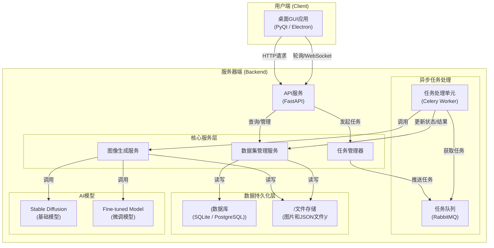

# 项目架构与开发计划文档

## 1. 引言

### 1.1. 文档目的

本文档旨在为"作战环境下军事目标数据集生成与管理平台"项目提供一个清晰、统一的顶层设计和实施路线图。其核心目的是：

- **定义系统架构**：阐述系统的前后端结构、模块划分及交互方式。
- **确定技术选型**：为项目的实现选择合适、高效的技术栈。
- **规划开发进程**：制定分阶段的开发里程碑和时间表，确保项目有序推进。

本文档的读者包括项目经理、架构师、开发人员和测试人员。

### 1.2. 参考文件

本文档的所有设计和规划均基于以下文件：

- `需求文档.md`

---

## 2. 系统架构

为了实现前后端分离、支持耗时任务处理并保证系统的可扩展性，我们采用**客户端-服务器（Client-Server）架构**，并引入**异步任务队列**来处理计算密集型的图像生成任务。

### 2.1. 架构图

### 2.2. 模块说明

- **桌面GUI应用 (Client)**：

  - **职责**：提供用户交互界面，用于配置生成参数、管理数据集、启动任务和预览结果。
  - **实现**：采用跨平台框架（如 PyQt 或 Electron）开发，确保在 Windows 和 Linux 上都能运行。通过HTTP协议与后端API服务进行通信。
- **API服务 (Backend)**：

  - **职责**：作为后端入口，接收前端的请求，进行参数校验，并调用相应的服务进行处理。例如，接收生成请求后，将任务交给任务管理器。
  - **实现**：使用轻量级的Python Web框架（如 FastAPI）构建RESTful API。
- **任务管理器 (TaskMan) & 异步任务处理**：

  - **职责**：核心解耦模块。对于耗时的图像生成任务，API服务不直接执行，而是将其作为一个任务项，交由任务管理器放入**任务队列**。独立的**任务处理单元(Worker)**会从队列中获取并执行任务。
  - **实现**：采用 Celery 作为任务调度框架，配合 RabbitMQ 作为消息中间件（任务队列）。为保证跨平台兼容性，Celery Worker在Windows环境下需要配置为兼容的模式运行。
- **图像生成服务 (GenSrv)**：

  - **职责**：实际执行图像生成的逻辑。内部包含两种实现：
    1. **传统蒙版合成器**：使用OpenCV、Pillow等库，执行目标与背景的叠加合成。
    2. **AI生成器**：调用 `diffusers`等库，加载Stable Diffusion模型（基础或微调），根据prompt生成图像，并包含失败重试逻辑。
- **数据集管理服务 (DataMan)**：

  - **职责**：负责数据集的元数据管理（增删改查）和文件管理。
  - **实现**：操作数据库来管理数据集信息，并操作文件系统来组织和存储生成的图片及标注文件。
- **数据持久化层**：

  - **数据库(DB)**：存储数据集的元信息，如名称、描述、图片数量、类别统计等。
  - **文件存储(FS)**：以特定的目录结构存储海量的图片文件和COCO格式的JSON标注文件。

### 2.3. 跨平台注意事项
为确保项目在 Windows 和 Linux 环境下均能稳定运行，需特别关注以下几点：
- **文件路径**：所有代码中涉及文件系统路径的操作，必须使用 `pathlib` 库来处理，避免硬编码 Windows (`\`) 或 Linux (`/`) 的路径分隔符。
- **异步任务**：Celery 在 Windows 上的支持是实验性的，且无法使用默认的 `prefork` 工作池。在开发和部署时，必须明确指定使用兼容的模式，如 `gevent` (`-P gevent`)。
- **消息队列**：推荐使用 RabbitMQ 作为消息中间件，因为它在所有主流操作系统上都有一致的、官方支持的本地化部署方案。相比之下，Redis 在 Windows 上的官方支持有限。

---

## 3. 技术选型

| 模块/层次              | 技术栈                            | 备注                                               |
| :--------------------- | :-------------------------------- | :------------------------------------------------- |
| **后端框架**     | Python 3.9+, FastAPI              | 高性能，现代化的API框架，与Python生态无缝集成。    |
| **前端GUI**      | PyQt6                             | 成熟的Python GUI框架，便于与Python后端进行集成。   |
| **异步任务队列** | Celery, RabbitMQ                  | RabbitMQ 提供更稳定的跨平台本地支持。Celery 在 Windows 下需使用 `gevent` 等兼容的工作池。   |
| **图像处理**     | OpenCV-Python, Pillow             | 功能强大的经典计算机视觉库。                       |
| **AI模型交互**   | Diffusers (Hugging Face), PyTorch | 主流的扩散模型库，便于加载和运行Stable Diffusion。 |
| **数据库ORM**    | SQLAlchemy, Alembic               | 强大的数据库工具，Alembic用于数据库迁移管理。      |
| **数据库**       | SQLite / PostgreSQL               | SQLite用于快速原型开发，PostgreSQL用于生产环境。   |

---

## 4. 开发计划

项目采用敏捷开发的思想，分为六个主要阶段（里程碑），每个阶段大约需要2-3周的开发时间。

### 4.1. 阶段一：项目基础与核心后端搭建

- **目标**：搭建项目骨架，完成核心后端服务的API定义和数据库模型。
- **任务**：
  1. 初始化Git仓库，配置开发环境。
  2. 使用FastAPI搭建API服务，定义数据集管理的CRUD接口。
  3. 设计并使用SQLAlchemy和Alembic实现数据库表结构。
  4. 实现数据集管理服务（DataMan）的基础逻辑。
  5. 编写单元测试，确保API和数据库操作正常。

### 4.2. 阶段二：传统蒙版图像生成

- **目标**：实现完整的传统图像合成、标注和存储流程。
- **任务**：
  1. 实现图像生成服务（GenSrv）中的传统蒙版合成器。
  2. 实现自动生成COCO JSON格式标注文件的功能。
  3. 集成Celery任务队列，将整个生成过程变为异步任务。
  4. 实现文件存储逻辑，将生成内容按（训练/验证/测试）集正确存放。

### 4.3. 阶段三：基础GUI开发与集成

- **目标**：开发可用的前端界面，并与后端对接，实现核心功能闭环。
- **任务**：
  1. 使用PyQt设计并实现主窗口、数据集列表、创建任务配置等界面。
  2. 实现GUI与后端API的通信，完成数据集的查询和管理功能。
  3. 实现启动"传统蒙版生成"任务的功能。
  4. 在GUI中添加任务状态轮询和结果展示功能。

### 4.4. 阶段四：AI图像生成集成

- **目标**：将基于Stable Diffusion的AI生成能力集成到平台中。
- **任务**：
  1. 完成Stable Diffusion 1.5/2.1模型的本地部署和测试。
  2. 在图像生成服务（GenSrv）中实现AI生成器，封装prompt构造和模型调用逻辑。
  3. 在Celery Worker中添加对AI生成任务的支持。
  4. 在GUI中添加"AI生成"的选项和相应配置。
  5. 实现AI生成失败的重试机制。

### 4.5. 阶段五：模型微调与高级功能

- **目标**：支持自定义模型的训练和使用，完善平台功能。
- **任务**：
  1. 开发或整理用于微调Stable Diffusion的训练脚本。
  2. 编写模型训练和部署的使用文档。
  3. 修改AI生成器，使其支持加载和使用用户微调后的模型权重。
  4. 在GUI中实现标注预览功能（临时BBox叠加）。

### 4.6. 阶段六：测试、打包与交付

- **目标**：完成系统整体测试，修复缺陷，并打包交付。
- **任务**：
  1. 进行全面的端到端功能测试和性能测试。
  2. 修复测试过程中发现的所有Bug。
  3. 编写详细的用户手册和部署文档。
  4. 使用PyInstaller或类似工具将应用打包成可在Windows/Linux上运行的可执行文件。
  5. 整理并交付全部源代码、模型、文档等。

---

## 5. 交付物清单

- 可在Windows/Linux下运行的应用程序。
- 完整的项目源代码。
- AI模型权重（针对定制化训练）、推理代码及训练脚本。
- 详细的《用户手册》和《部署说明》。
- 所有相关的设计与规划文档（需求、架构等）。
